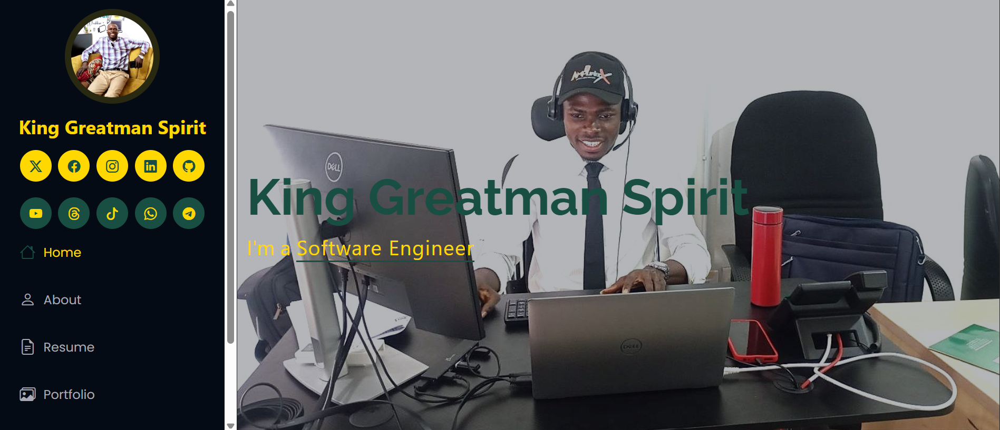
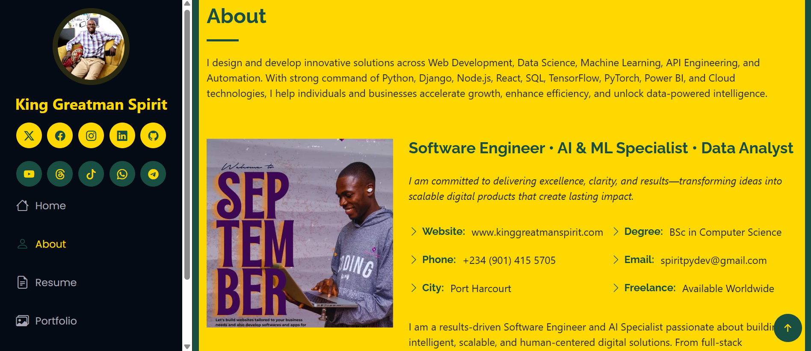
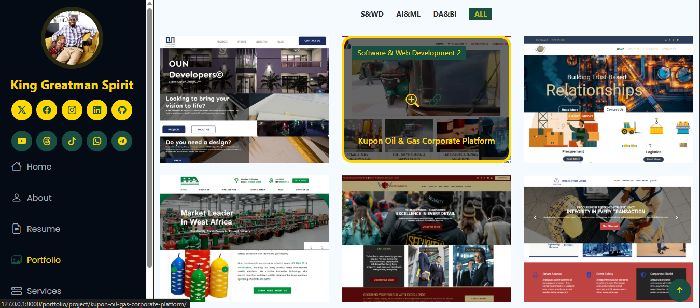
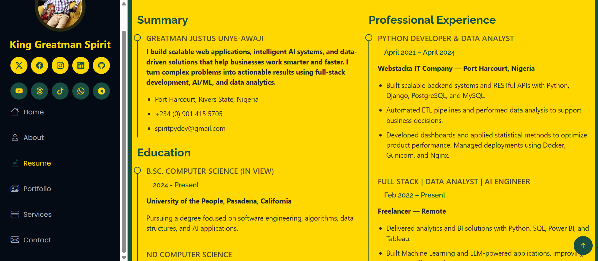
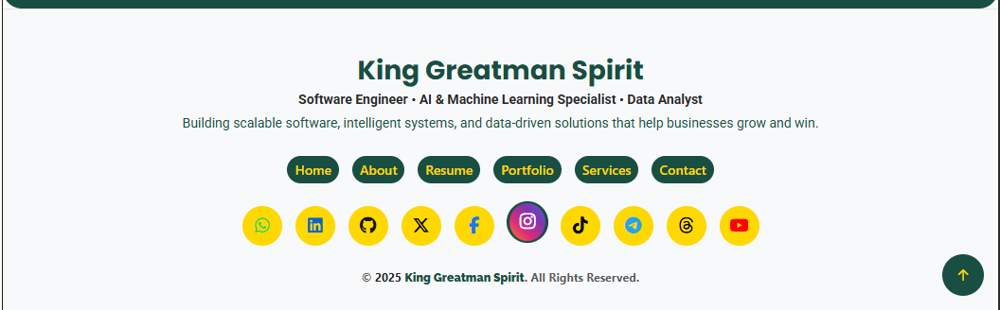

# 🌟 King GREATMAN SPIRIT (KGS) — Personal Portfolio Website

**King GREATMAN SPIRIT (KGS)** is a modern, scalable, and SEO-optimized **personal portfolio web application** built with **Django**.
It serves as a digital identity hub, showcasing **projects, skills, services, testimonials, and professional connections** — designed for **recruiters, clients, collaborators, and tech enthusiasts worldwide**.

This project reflects **clean architecture, strong branding, and real-world production practices**.

---

## 🔥 Key Highlights

* 🚀 **Fully Dynamic Portfolio System**
  Manage projects, images, categories, and descriptions from Django Admin.

* 🧠 **Professional Services Showcase**
  Clearly present service offerings with structured layouts and branding.

* 💬 **Client Testimonials**
  Display real feedback to build trust and credibility.

* 🌍 **Global Contact System**
  International-ready contact form with structured validation.

* 🌐 **Rich Social Media Integration**
  Seamlessly connects GitHub, LinkedIn, WhatsApp, Instagram, X (Twitter), Facebook, TikTok, YouTube, Threads, Telegram, and more.

* 📈 **SEO-Optimized Architecture**
  Clean URLs, meta tags, semantic HTML, and performance-focused design.

* 📱 **Fully Responsive UI**
  Optimized for mobile, tablet, and desktop devices.

* ⚙️ **Admin-Driven Content Management**
  Update content without touching code.

---

## 🧰 Tech Stack

**Backend**

* Django (Python)

**Frontend**

* Bootstrap 5
* HTML5, CSS3
* JavaScript (ES6)

**Database**

* SQLite (Development)
* PostgreSQL (Production-ready)

**UI & Enhancements**

* Font Awesome
* Bootstrap Icons
* Owl Carousel
* Master Slider
* Smart Selects

---

## 🎯 Purpose & Vision

This project is more than a website — it is a **personal brand platform**.

It is built to:

* Impress recruiters and hiring managers
* Convert visitors into clients
* Showcase real technical depth and design thinking
* Grow alongside professional experience

Perfect for:

* Developers & Data Professionals
* Freelancers & Consultants
* Personal Branding & Online Presence

---

## 🖼️ Application Preview

Below are selected screenshots showcasing the UI, structure, and features of the **King GREATMAN SPIRIT (KGS)** portfolio.

> A visual overview of the key pages and components of the King GREATMAN SPIRIT (KGS) portfolio application.

| Home | About | Services |
|------|-------|----------|
|  |  |  |

| Service Detail | Portfolio | Portfolio Detail |
|----------------|-----------|------------------|
|  |  |  |

| Resume | Contact | Sidebar |
|--------|---------|---------|
|  |  |  |

| Footer |
|--------|
|  |

---

### ✅ Notes

* Ensure all images are located in `preview/` relative to your **repository root**.
* Keep image filenames **exactly matching** your Markdown paths (case-sensitive on GitHub).
* Tables help maintain a neat layout, and GitHub automatically resizes the images to fit.
* You can add more screenshots in the same structure if needed.

---

## 📦 Installation & Setup

### 1️⃣ Clone the Repository

```bash
git clone https://github.com/King-Greatman-Spirit/king-greatman-spirit-portfolio.git
cd king-greatman-spirit-portfolio
```

### 2️⃣ Create & Activate Virtual Environment

```bash
python -m venv venv
source venv/bin/activate   # macOS/Linux
venv\Scripts\activate      # Windows
```

### 3️⃣ Install Dependencies

```bash
pip install -r requirements.txt
```

### 4️⃣ Apply Migrations

```bash
python manage.py migrate
```

### 5️⃣ Run Development Server

```bash
python manage.py runserver
```

Access the app at:

```
http://127.0.0.1:8000/
```

---

## 🌍 Deployment

The project is production-ready and can be deployed on:

* Render
* Railway
* PythonAnywhere
* VPS (Nginx + Gunicorn)
* Docker-based environments

---

## 🔐 Security & Best Practices

* Environment-based configuration
* Secure Django settings structure
* Admin-only content management
* Ready for production hardening

---

## 📄 License

This project is licensed under the **MIT License** — free to use, modify, and distribute.

---

> **“Your online presence is your digital signature — make it timeless.”**
> **King GREATMAN SPIRIT (KGS)**
> *Digital Creator • Data Analyst • AI & Software Engineer*

---

## 🌐 Connect with Me

Stay in touch or follow my work on social media and professional networks:

| Platform          | Link                                                                    |
| ----------------- | ----------------------------------------------------------------------- |
| **Facebook**      | [FAMOUSGREATMAN](https://www.facebook.com/FAMOUSGREATMAN)               |
| **X (Twitter)**   | [@greatestmaneva](https://www.twitter.com/greatestmaneva)               |
| **Instagram**     | [king_greatman_spirit](https://www.instagram.com/king_greatman_spirit/) |
| **TikTok**        | [@king_greatman_spirit](https://www.tiktok.com/@king_greatman_spirit)   |
| **Telegram**      | [t.me/greatestmaneva](https://t.me/greatestmaneva)                      |
| **YouTube**       | [greatestmaneva](https://www.youtube.com/@greatestmaneva)               |
| **LinkedIn**      | [Greatman Justus](https://www.linkedin.com/in/greatman-pydev)           |
| **WhatsApp Chat** | [Click to Chat](https://wa.me/2349014155705)                            |
| **Linktree**      | [Linktree Profile](https://linktr.ee/greatestmaneva)                    |

---

