# 👑 King GREATMAN SPIRIT (KGS) — Premium Portfolio & Business Platform

> **Software Engineer • AI & ML Specialist • Data Analyst** — A world-class personal brand platform built with **Django**, engineered to convert visitors into clients.

[](https://python.org)
[](https://djangoproject.com)
[](https://getbootstrap.com)
[](https://kinggreatmanspirit.com)
[](https://wa.me/2349014155705)
[](#)
[](LICENSE)

---

## ✨ Why This Platform Stands Out

The **King GREATMAN SPIRIT (KGS)** platform is a complete digital business engine — not just a portfolio. It combines a **premium dark-navy / gold / emerald** brand identity with a full owner-side command center:

* 🗂️ **Fully Dynamic Portfolio** — Projects, skills, services, testimonials, education & experience managed from Django Admin or the custom dashboard.
* 🤖 **KGS AI Chat Assistant** — Intent-matching assistant with live replies, typing indicator, quick-action chips, and a deep link to live human support (`/#chat`).
* 🎧 **"Talk to King Directly" Live Support** — Visitors request live help from inside the chatbot; the owner gets an **instant WhatsApp / SMS alert** (Twilio) with an **email fallback**, and every ticket lands in the dashboard.
* 🔒 **Owner Dashboard (`/dashboard/`)** — Login, live overview with stats & 6-month chart, profile & socials editor, generic CRUD for all site content, leads, newsletter subscribers (with CSV export), payments and ticket management.
* 💳 **Global Secure Payments** — Deposit or pay via **Flutterwave, Paystack & Binance Pay** — cards, bank transfer, USSD, mobile money and crypto, **in any currency — USD, NGN, GBP, EUR, JPY & major world currencies** — with an instant branded receipt in the visitor's inbox.
* ✉️ **Branded Email System** — Newsletter confirmation, contact notifications, payment receipts and ticket alerts — all with **inline-attached profile images, cover banners and favicon socials**.
* 📈 **Conversion Tracking** — Google Site Verification (GSC) + GA4 event tracking for every key action: chat opened, ticket sent, payment started, WhatsApp clicked.
* 🌍 **World-Class SEO** — Semantic HTML, JSON-LD structured data, sitemap.xml, robots.txt, canonical URLs and Open Graph tags.

---

## 🖼️ Application Preview

### Public Website

| Home | About | Services |
|------|-------|----------|
| 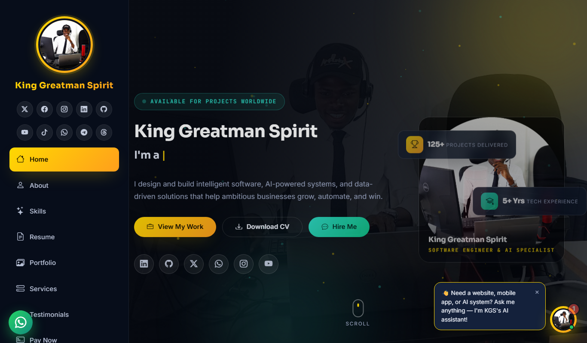 | 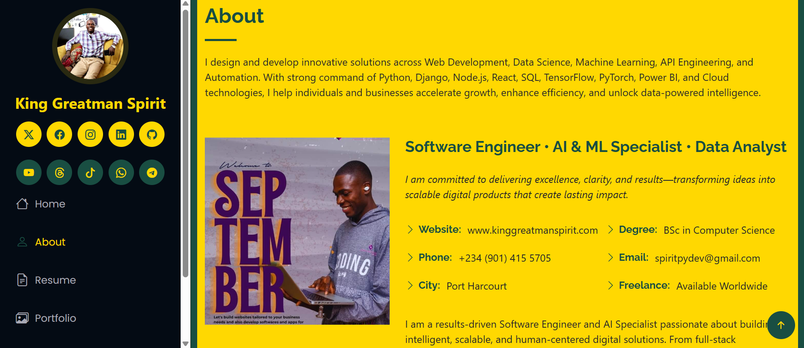 | 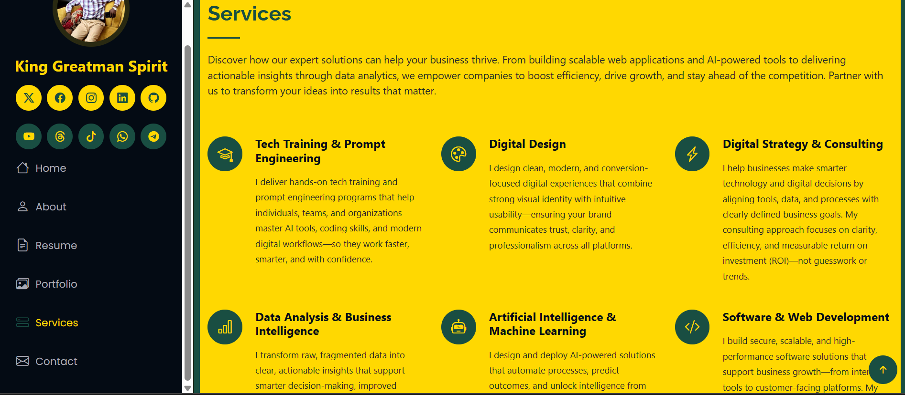 |

| Portfolio | Resume | Contact |
|-----------|--------|---------|
| 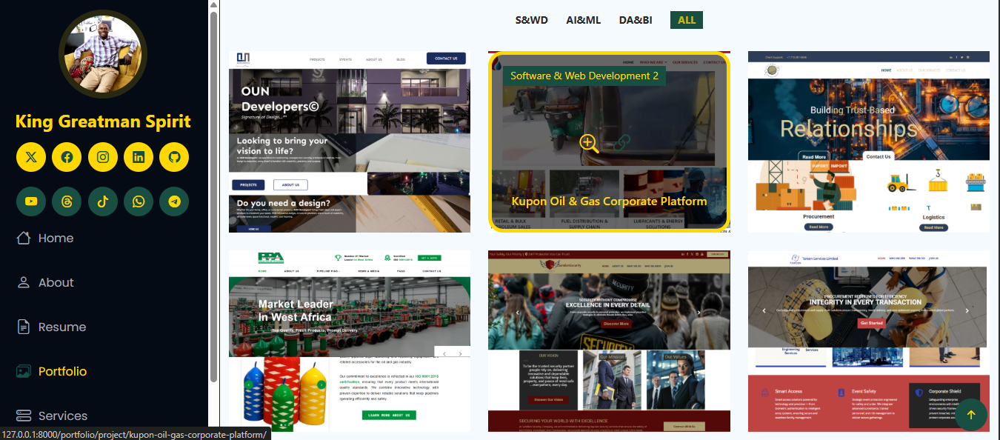 | 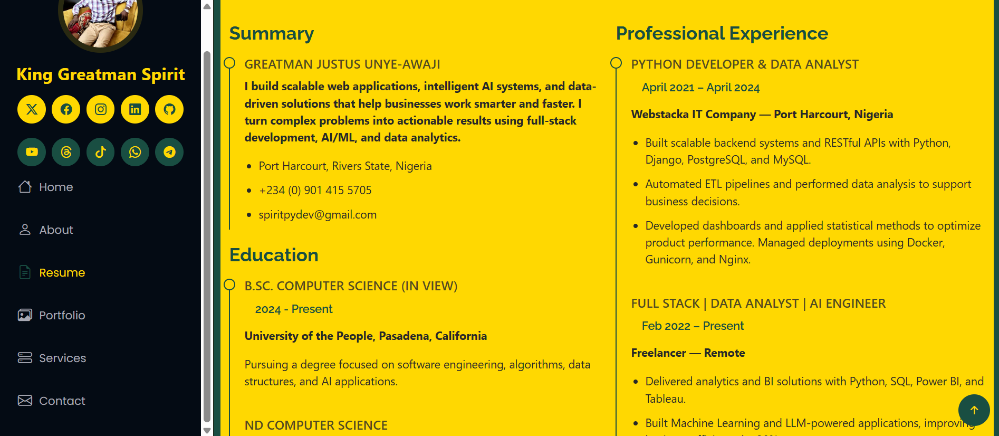 | 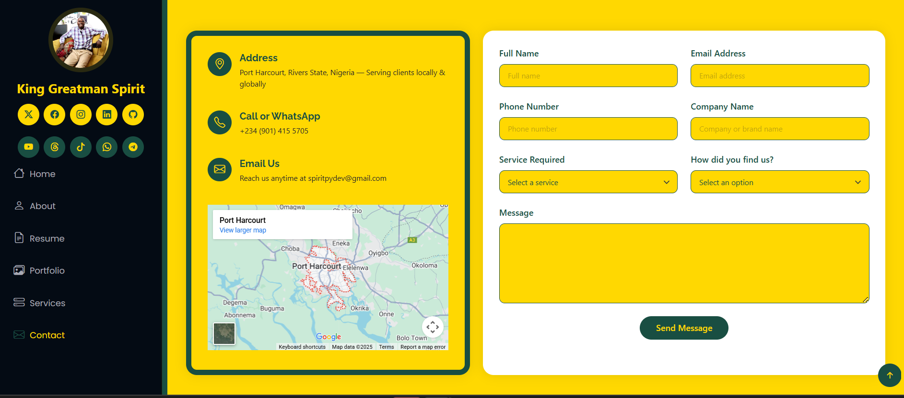 |

### AI Assistant & Owner Dashboard

| KGS AI Chat Assistant | Dashboard — Login | Dashboard — Overview |
|----------------------|-------------------|----------------------|
| 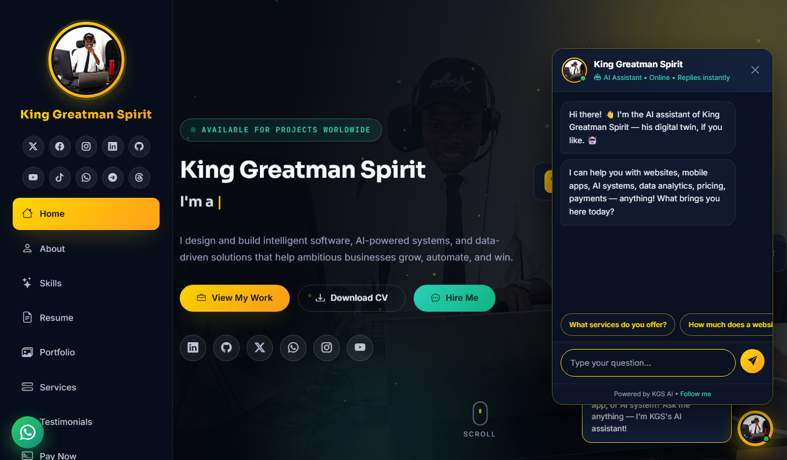 | 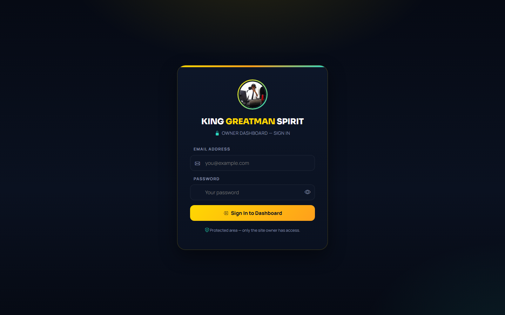 | 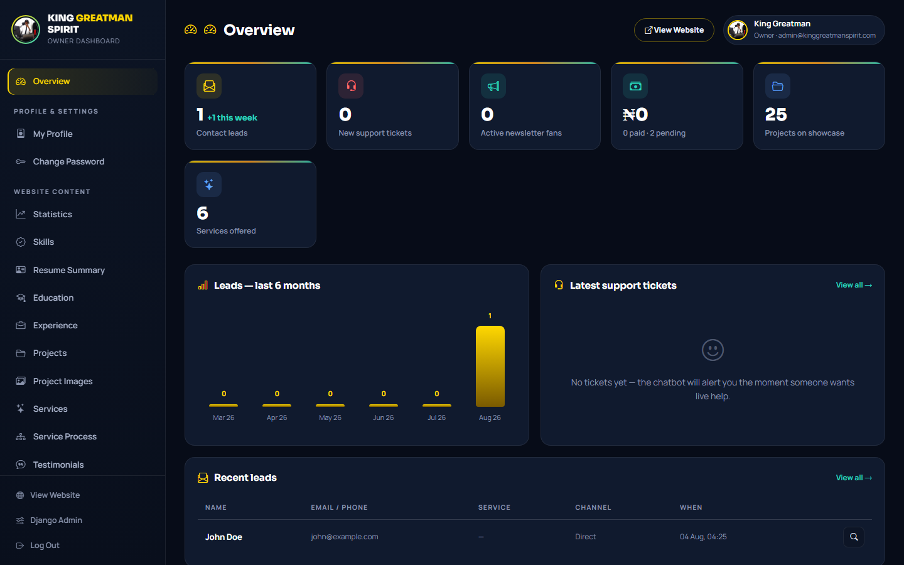 |

| Dashboard — Tickets | Dashboard — Payments | Footer |
|---------------------|----------------------|--------|
| 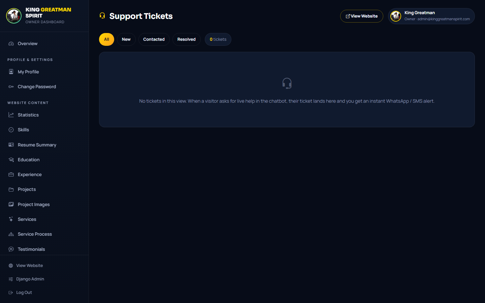 | 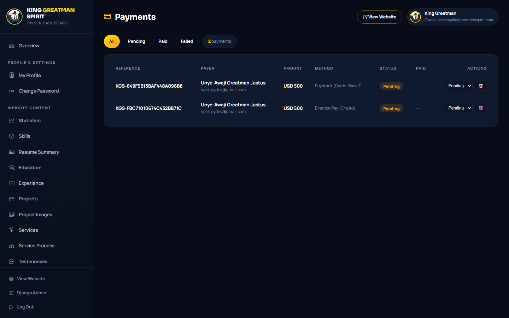 | 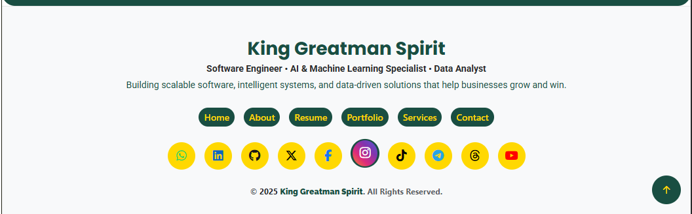 |

---

## 🧰 Tech Stack

**Backend**

* Django 5.2 (Python) · Django REST Framework-ready patterns
* SQLite (dev) → PostgreSQL (production)
* Twilio (WhatsApp + SMS alerts) · SMTP email (business inbox ready)

**Frontend**

* Bootstrap 5 · HTML5 · CSS3 · JavaScript (ES6)
* AOS animations · Typed.js · Swiper · Isotope · GLightbox
* Bootstrap Icons · Google Fonts

**Payments & Analytics**

* Flutterwave · Paystack · Binance Pay
* GA4 (gtag.js) · Google Search Console

---

## 🚀 Getting Started

### 1️⃣ Clone & Prepare

```bash
git clone https://github.com/King-Greatman-Spirit/king-greatman-spirit-portfolio.git
cd king-greatman-spirit-portfolio

python -m venv venv
venv\Scripts\activate        # Windows
source venv/bin/activate     # macOS/Linux

pip install -r requirements.txt
python manage.py migrate
python manage.py createsuperuser
```

### 2️⃣ Configure Environment (`.env`)

| Variable | Purpose | Required |
|---|---|---|
| `SECRET_KEY` | Django secret | ✅ |
| `DEBUG` | `True` in dev, `False` in prod | ✅ |
| `SITE_URL` | Canonical site URL (used in emails/SEO) | ✅ |
| `GOOGLE_SITE_VERIFICATION` | GSC verification meta tag | Optional |
| `GA4_MEASUREMENT_ID` | Google Analytics 4 property (e.g. `G-XXXXXXX`) | Optional |
| `EMAIL_HOST_USER` / `EMAIL_HOST_PASSWORD` | SMTP sender (Gmail app password or business inbox) | ✅ |
| `TWILIO_ACCOUNT_SID` / `TWILIO_AUTH_TOKEN` | WhatsApp/SMS alerts for live-support tickets | Optional |
| `TWILIO_WHATSAPP_FROM` | e.g. `whatsapp:+14155238886` | Optional |
| `SUPPORT_NOTIFY_WHATSAPP_TO` / `SUPPORT_NOTIFY_PHONE` / `SUPPORT_NOTIFY_EMAIL` | Where ticket alerts are sent | Optional |
| `PAYSTACK_PUBLIC_KEY` / `PAYSTACK_SECRET_KEY` | Paystack payments | Optional |
| `FLW_PUBLIC_KEY` / `FLW_SECRET_KEY` | Flutterwave payments | Optional |
| `BINANCE_API_KEY` / `BINANCE_SECRET_KEY` | Binance Pay (crypto) | Optional |

### 3️⃣ Run

```bash
python manage.py runserver
```

* Public site → `http://127.0.0.1:8000/`
* Owner dashboard → `http://127.0.0.1:8000/dashboard/login/`
* Django admin → `http://127.0.0.1:8000/admin/`

---

## 🧭 Owner Dashboard Tour

| Page | What you can do |
|---|---|
| **Overview** | Live stats, 6-month chart, recent leads / payments / tickets / subscribers |
| **Profile** | Edit bio + all socials with image previews |
| **Content CRUD** | Stats, skills, summaries, education, experience, projects, images, services, processes, testimonials |
| **Contacts** | Search leads, one-click WhatsApp / email reply |
| **Newsletter** | Browse, unsubscribe, delete, **export CSV** |
| **Payments** | Track deposits & payments, update status, delete |
| **Tickets** | Live-support requests from the chatbot — statuses, WhatsApp reply, delete |

---

## 🤖 AI Chatbot Highlights

* Floating photo launcher with typing indicator, teaser bubble & notification badge
* Intent engine: services, pricing, payment, portfolio, contact, resume, training & more
* **Live-support handoff** — visitor fills a quick form → owner alerted via WhatsApp/SMS/email
* Branded pill links (WhatsApp / email / portfolio / payments)
* Deep-link: `https://kinggreatmanspirit.com/#chat` opens the chat instantly

---

## 🌍 Deployment

Production-ready for **Render · Railway · PythonAnywhere · VPS (Nginx + Gunicorn) · Docker**.

```bash
python manage.py collectstatic
gunicorn KingGreatmanSpirit.wsgi:application --bind 0.0.0.0:8000
```

---

## 🔐 Security & Best Practices

* Environment-based configuration — no secrets in code
* Staff-only dashboard access, POST-only public endpoints
* Escaped / sanitized chatbot rendering (XSS-safe link allowlist)
* Honeypot fields + server-side validation on all forms
* Production hardening ready (HTTPS, secure cookies, PostgreSQL)

---

## 📄 License

**MIT License** — free to use, modify, and distribute.

---

> **"Your online presence is your digital signature — make it timeless."**
> **King GREATMAN SPIRIT (KGS)**
> *Digital Creator • Data Analyst • AI & Software Engineer*

---

## 🌐 Connect with Me

| Platform | Link |
|---|---|
| **Website** | [kinggreatmanspirit.com](https://kinggreatmanspirit.com) |
| **Email** | [hello@kinggreatmanspirit.com](mailto:hello@kinggreatmanspirit.com) |
| **WhatsApp Chat** | [Click to Chat](https://wa.me/2349014155705) |
| **LinkedIn** | [Greatman Justus](https://www.linkedin.com/in/greatman-pydev) |
| **X (Twitter)** | [@greatestmaneva](https://www.twitter.com/greatestmaneva) |
| **Instagram** | [king_greatman_spirit](https://www.instagram.com/king_greatman_spirit/) |
| **GitHub** | [King-Greatman-Spirit](https://github.com/King-Greatman-Spirit) |
| **Linktree** | [Linktree Profile](https://linktr.ee/greatestmaneva) |
